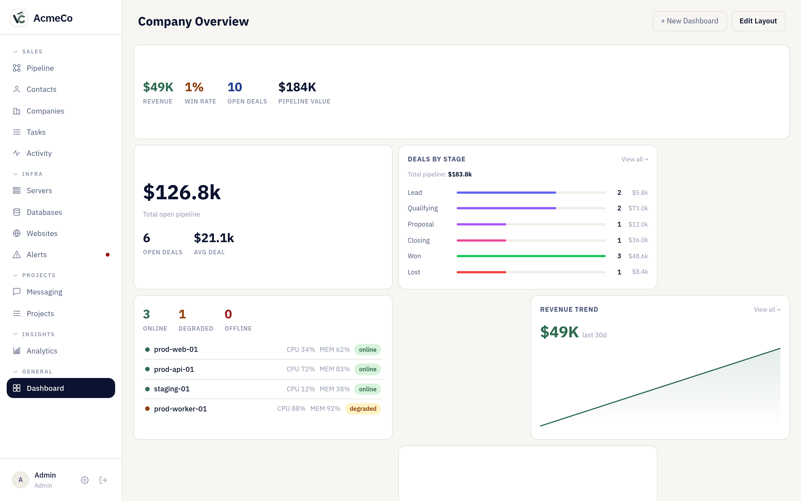
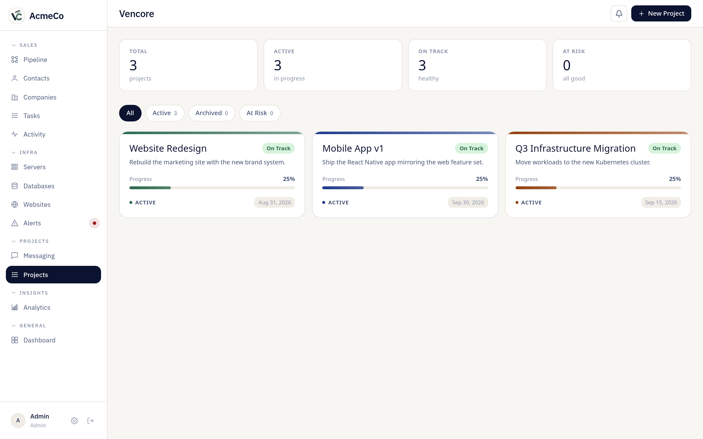
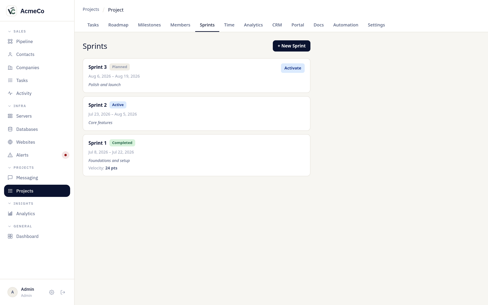
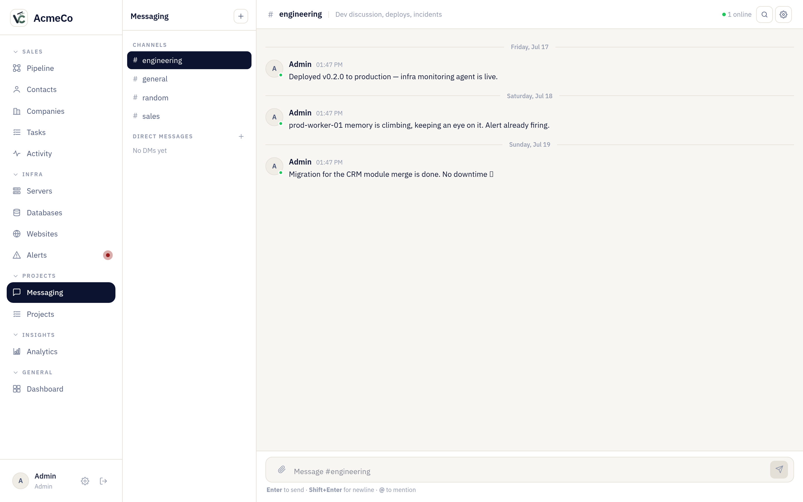
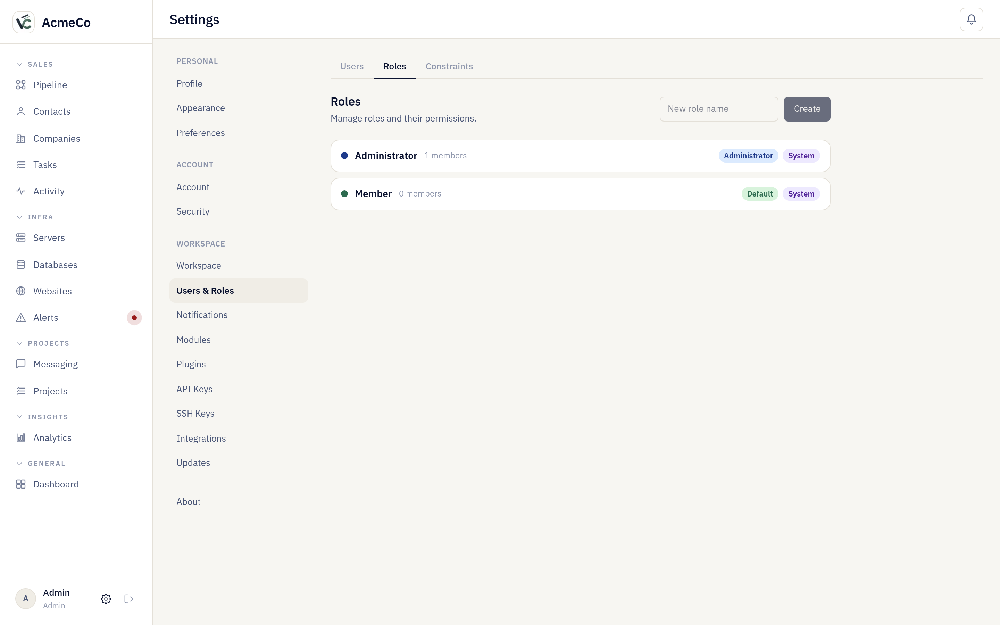
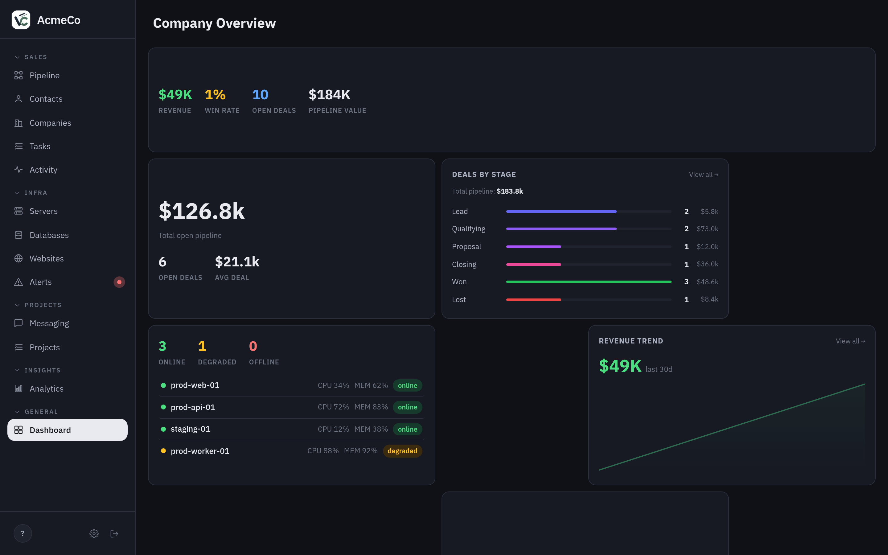

<p align="center">
  
</p>

<h1 align="center">Vencore</h1>

<p align="center">
  <strong>The open-source, self-hosted company OS.</strong><br/>
  White-label CRM, project management, infrastructure monitoring & analytics — one modular, multi-tenant platform.
</p>

<p align="center">
  <a href="LICENSE"></a>
  
  
  
</p>

<p align="center">
  
  
</p>

Vencore is an **open-source, self-hosted company management platform** — run your entire business from one place. Bring your CRM, project management, infrastructure monitoring, team messaging, analytics, and a client portal under a single **white-label** roof, then enable only the modules your teams need. Fully **multi-tenant**, extensible with a **plugin marketplace + SDK**, and dependency-light: it runs on Postgres and Redis with no external SaaS lock-in.

> **One platform to run your entire business.**

## Why self-hosted & white-label

- **Own your data.** Runs on your infrastructure. No third-party auth service, no data leaving your servers.
- **Brand it as yours.** Custom name, logo, and domain per workspace — your users never see "Vencore".
- **Modular.** Toggle CRM, projects, infra, analytics, messaging, and plugins independently via a config file.
- **Multi-tenant.** Workspace-scoped by design — every query is isolated per tenant.
- **Extensible.** A first-class plugin system with a typed SDK and an in-app marketplace.

## Screenshots

<p align="center">
  
  
</p>

<details>
<summary>More screenshots</summary>
<br>









</details>

## Features

### CRM
- **Pipeline** — Kanban board with custom stages, per-stage custom fields (text, number, date, select, boolean), drag-to-move cards, and multiple item groups per pipeline.
- **Contacts & Companies** — Full CRUD with CSV import/export on every list view, tags, and owners.
- **Tasks** — Assign to contacts, deals, or projects; filter by status, assignee, and due date.
- **Activity feed** — Unified timeline of emails, calls, notes, meetings, deal changes, and infra alerts.

### Projects & Project Management
- **Boards & views** — Projects with tasks, custom fields, and multiple views.
- **Milestones & sprints** — Plan work in sprints, track milestones and progress.
- **Time logs & recurring work** — Log time; schedule recurring tasks and rules.
- **Automation** — Rule-based automations across the PM workflow.
- **Client portal** — A branded, permissioned portal for external clients.

### Infrastructure Monitoring
- **Server monitoring** — A lightweight Node.js agent phones home every 30 seconds with CPU, memory, disk, and uptime. No inbound connections to your servers.
- **Database health** — Connect Postgres, MySQL, Redis, or MongoDB; the worker checks connection health and replication lag every 60 seconds.
- **Website uptime** — Track response time and status for any URL; SSL expiry checked daily.
- **Alerts** — Threshold alerts (CPU > 85%, disk > 90%, replication lag > 10s, site down) with a real-time alert bar across every page.

### Analytics
- Revenue by period, pipeline value by stage, win rate, per-rep leaderboard, and a configurable analytics hub.

### Messaging
- Built-in team messaging with real-time delivery (SSE).

### Plugins & Marketplace
- A first-class **plugin system** with a typed SDK (`plugin-runtime`, `plugin-types`) and an in-app **marketplace** to install and manage plugins. See [`plugin-docs/`](plugin-docs/).

### Platform
- **Multi-user RBAC** — Configurable roles and permissions beyond simple admin/member.
- **White-label branding** — Per-workspace name, logo, and domain.
- **Public REST API** — Versioned `/api/v1` with API-key auth and outgoing webhooks.
- **Notifications** — In-app and email notifications with per-user preferences.
- **Setup wizard** — Guided first-run configuration.
- **Self-updating** — Instance updater with semver-aware releases.
- **Feature flags** — Enable/disable modules independently via `vencore.config.json`.

## Architecture

Turborepo monorepo — applications plus shared packages:

```
apps/
  web/      Next.js 14 (App Router) — the dashboard, portal, plugin UI
  api/      Express REST API — all data operations + public /api/v1
  worker/   Background jobs — website pings, alert evaluation, DB health

packages/
  db/              Kysely database client + schema types
  types/           Shared TypeScript types across apps
  config/          Config schema + loader (vencore.config.json)
  modules/         Module registry and shared module logic
  plugin-runtime/  Plugin execution runtime
  plugin-types/    Public plugin SDK types
  api-client/      Typed API client shared by web + plugins
```

**Data flow:** each server agent POSTs metrics to `/api/agent/ping` every 30s with a per-server token. The worker runs every 60s, evaluates thresholds, and writes alert records. The frontend polls `/api/alerts` every 60s for the alert bar; live updates stream over SSE.

**Auth:** JWT cookies (`httpOnly`, `SameSite=Strict`). First boot seeds an admin user and prints credentials to stdout. No third-party auth service.

**Database:** PostgreSQL 15 + TimescaleDB (time-series metrics). All queries go through Kysely — no raw SQL strings. Workspace-scoped middleware guarantees tenant isolation.

## Tech Stack

| Layer | Choice |
|---|---|
| Frontend | Next.js 14, TypeScript, TanStack Query |
| Backend | Node.js, Express, TypeScript, Zod |
| ORM | Kysely |
| Database | PostgreSQL 15 + TimescaleDB |
| Cache / realtime | Redis + Server-Sent Events |
| Plugins | Typed plugin runtime + SDK |
| Monorepo | Turborepo + pnpm workspaces |

## Getting Started

### Prerequisites
- Node.js ≥ 20
- pnpm ≥ 9
- Docker (for Postgres + Redis)

### 1. Clone and install
```bash
git clone https://github.com/vencorehq/vencore.git
cd vencore
pnpm install
```

### 2. Start the database
```bash
docker compose up -d
```
Starts PostgreSQL (with TimescaleDB) on 5432 and Redis on 6379.

### 3. Configure environment
```bash
cp .env.example apps/api/.env
cp .env.example apps/web/.env.local
cp .env.example apps/worker/.env
```
Set a random `JWT_SECRET` in `apps/api/.env`:
```bash
openssl rand -hex 32
```

### 4. Configure the app
Copy `vencore.config.example.json` to `vencore.config.json` and enable the modules you want:
```json
{
  "app": { "name": "YourCo", "domain": "localhost" },
  "features": { "crm": true, "projects": true, "infra": true, "alerts": true, "analytics": true, "messaging": true, "plugins": true },
  "databases": []
}
```

### 5. Migrate and run
```bash
pnpm db:migrate
pnpm dev
```
The web app runs at http://localhost:3000. On first boot the API prints admin credentials:
```
[VENCORE] First boot admin: admin@localhost / <generated-password>
```
Or complete setup through the built-in **setup wizard** at `/setup`.

### 6. (Optional) Install the server agent
On any server you want to monitor — register it in the dashboard to get a token, then:
```bash
VENCORE_TOKEN=<your-token> \
VENCORE_API_URL=https://your-vencore-instance.com \
npx vencore-agent
```

## Configuration

`vencore.config.json` is the single source of truth for instance-level settings; the API and worker read it at startup.

| Key | Description |
|---|---|
| `app.name` | Workspace name shown in the sidebar |
| `app.domain` | Used to generate the admin email on first boot |
| `app.logoUrl` | Path or URL to a custom logo |
| `features.*` | Toggle CRM, projects, infra, analytics, alerts, messaging, plugins independently |
| `smtp` | SMTP config for email notifications |
| `databases` | Pre-seed database connections (idempotent on restart) |

## API

Every response follows one envelope:
```json
{ "data": { ... }, "error": null }
{ "data": null, "error": { "code": "NOT_FOUND", "message": "..." } }
```
Authenticated routes are workspace-scoped. A stable public API lives under `/api/v1` with API-key auth and webhooks. Route source: [`apps/api/src/routes/`](apps/api/src/routes/).

## Plugins

Vencore ships a typed plugin SDK and an in-app marketplace. Build backend handlers, frontend surfaces, and permission bridges. Start with the [plugin docs](plugin-docs/).

## Development

```bash
pnpm dev          # Start all apps in watch mode
pnpm build        # Build everything
pnpm type-check   # TypeScript check across all packages
pnpm db:migrate   # Run pending migrations
```
Run an app individually:
```bash
cd apps/api && pnpm dev
cd apps/web && pnpm dev
cd apps/worker && pnpm dev
```

## Contributing

PRs welcome — see [CONTRIBUTING.md](CONTRIBUTING.md) and our [Code of Conduct](CODE_OF_CONDUCT.md).

## License

MIT — see [LICENSE](LICENSE).
