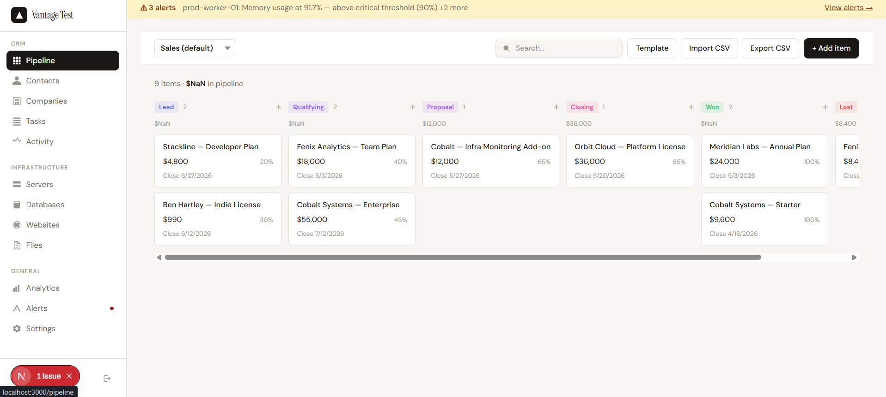
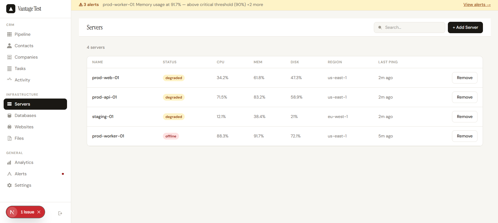
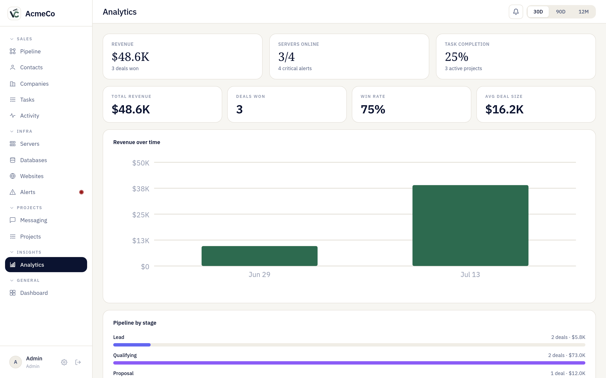
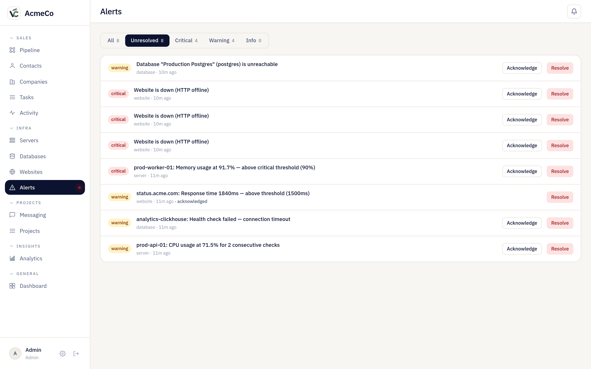
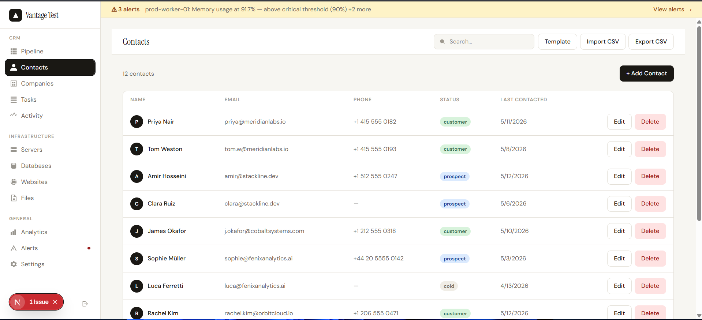
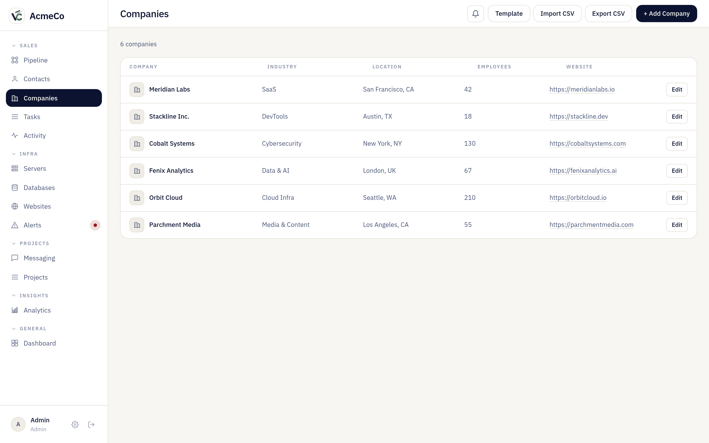
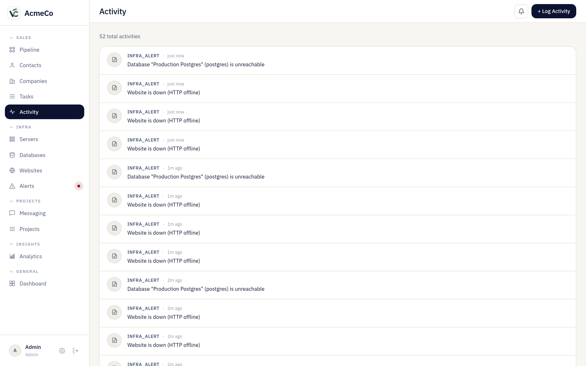
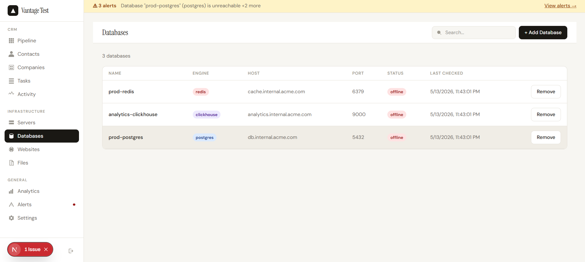
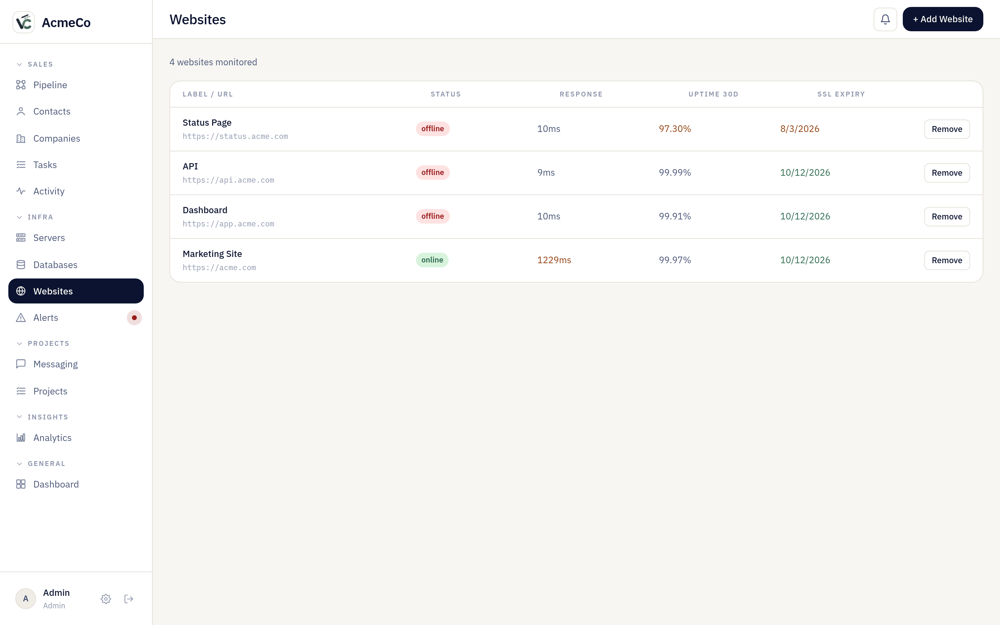
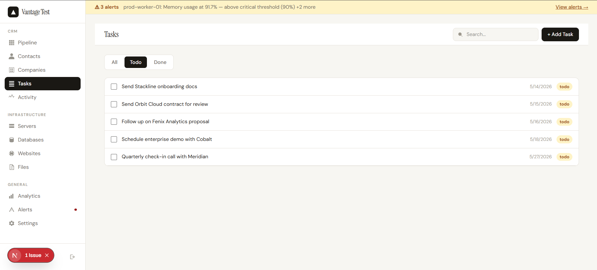

<p align="center">
  
</p>

# Vencore

**One Platform to Run Your Entire Business**

Vencore is a modular company management solution. Bring together your CRM, HR, infrastructure monitoring, team tasks, analytics, and billing — all in one self-hosted platform. Add the modules your business needs, skip the ones you don't.

Self-hosted, config-file driven, no external service dependencies beyond Postgres and Redis.

<p align="center">
  
  
</p>
<p align="center">
  
  
</p>

<details>
<summary>More screenshots</summary>
<br>








</details>

---

## Features

### CRM
- **Pipeline** — Kanban board with custom stages, custom fields per stage, and drag-to-move cards. Supports multiple item groups within a single pipeline.
- **Contacts & Companies** — Full CRUD with CSV import/export on every list view.
- **Tasks** — Assign tasks to contacts or deals, filter by status and due date.
- **Activity feed** — Unified timeline of emails, calls, notes, meetings, and deal changes.

### Infrastructure
- **Server monitoring** — Install the lightweight Node.js agent on any server. It phones home every 30 seconds with CPU, memory, disk, and uptime. No inbound connections to your servers required.
- **Database health** — Connect your Postgres, MySQL, Redis, or MongoDB instances. The background worker checks connection health and replication lag every 60 seconds.
- **Website uptime** — Add any URL, get response times and status tracked continuously. SSL expiry is checked daily.
- **Alerts** — Threshold-based alerts for CPU > 85%, disk > 90%, replication lag > 10s, site down, and more. Real-time alert bar visible across all CRM pages.

### Analytics
- Revenue by period, pipeline value by stage, win rate, per-rep leaderboard.

### General
- CSV import and export on contacts, companies, and deals
- Custom pipeline stages with per-stage custom fields (text, number, date, select, boolean)
- Multi-user with role-based access (admin / member)
- Feature flags via config file — disable CRM, infra, analytics independently

---

## Architecture

Turborepo monorepo with four applications and three shared packages:

```
apps/
  web/      Next.js 14 (App Router) — the dashboard
  api/      Express REST API — all data operations
  worker/   Background job runner — website pings, alert evaluation, DB health

packages/
  db/       Kysely database client + schema types
  types/    Shared TypeScript types across apps
  config/   Config file schema and loader (vencore.config.json)
```

**Data flow:** The agent on each server POSTs metrics to `/api/agent/ping` every 30 seconds using a per-server token. The worker runs every 60 seconds, evaluates thresholds, and creates alert records in the database. The frontend polls `/api/alerts` every 60 seconds to show the alert bar.

**Auth:** JWT cookies (`httpOnly`, `SameSite=Strict`). First-boot seeds an admin user and prints credentials to stdout. No third-party auth service.

**Database:** PostgreSQL 15 with the TimescaleDB extension (for time-series metrics). All CRM queries use Kysely — no raw SQL strings. Workspace-scoped middleware ensures no cross-tenant data leaks.

---

## Tech Stack

| Layer | Choice |
|---|---|
| Frontend | Next.js 14, TypeScript, TanStack Query |
| Backend | Node.js, Express, TypeScript, Zod |
| ORM | Kysely |
| Database | PostgreSQL 15 + TimescaleDB |
| Cache | Redis |
| Monorepo | Turborepo + pnpm workspaces |

---

## Getting Started

### Prerequisites

- Node.js ≥ 20
- pnpm ≥ 9
- Docker (for the local database)

### 1. Clone and install

```bash
git clone https://github.com/Kavin-Charles/vencore.git
cd vencore
pnpm install
```

### 2. Start the database

```bash
docker compose up -d
```

This starts PostgreSQL (with TimescaleDB) on port 5432 and Redis on 6379.

### 3. Configure environment

Copy the example env files:

```bash
cp .env.example apps/api/.env
cp .env.example apps/web/.env.local
cp .env.example apps/worker/.env
```

At minimum, set `JWT_SECRET` in `apps/api/.env` to something random:

```bash
# macOS / Linux
openssl rand -hex 32
```

### 4. Configure the app

Copy `vencore.config.example.json` to `vencore.config.json` and update it:

```json
{
  "app": {
    "name": "YourCo",
    "domain": "localhost"
  },
  "features": {
    "crm": true,
    "infra": true,
    "alerts": true,
    "analytics": true,
    "files": false
  },
  "databases": []
}
```

### 5. Run migrations and start

```bash
pnpm db:migrate
pnpm dev
```

The web app runs at [http://localhost:3000](http://localhost:3000). On first boot, the API prints the admin credentials to its console output:

```
[VENCORE] First boot admin: admin@localhost / <generated-password>
```

### 6. (Optional) Install the server agent

On any server you want to monitor:

```bash
# Register the server in the dashboard first to get a token, then:
VENCORE_TOKEN=<your-token> \
VENCORE_API_URL=https://your-vencore-instance.com \
npx vencore-agent

---

## Configuration

`vencore.config.json` is the single source of truth for instance-level settings. The API and worker both read from it at startup.

| Key | Description |
|---|---|
| `app.name` | Workspace name shown in the sidebar |
| `app.domain` | Used to generate the admin email on first boot |
| `app.logoUrl` | Path or URL to a custom logo |
| `features.*` | Toggle CRM, infra monitoring, analytics, alerts, files independently |
| `smtp` | SMTP config for email notifications |
| `databases` | Pre-seed database connections (idempotent on restart) |

---

## API

All endpoints follow the same response envelope:

```json
{ "data": { ... }, "error": null }
{ "data": null, "error": { "code": "NOT_FOUND", "message": "..." } }
```

Every authenticated route is workspace-scoped. A full route reference is in [`apps/api/src/routes/`](apps/api/src/routes/).

---

## Development

```bash
pnpm dev          # Start all apps in watch mode
pnpm build        # Build everything
pnpm type-check   # TypeScript check across all packages
pnpm db:migrate   # Run pending migrations
```

Each app can also be run individually:

```bash
cd apps/api && pnpm dev
cd apps/web && pnpm dev
cd apps/worker && pnpm dev
```

---

## Project Structure

```
apps/api/src/
  routes/         One file per resource (contacts, deals, pipelines, …)
  lib/            Auth middleware, logger, seed, DB helpers
  migrations/     SQL migration files (numbered, never modified after merge)

apps/web/
  app/(dashboard) Route segments — one folder per page
  components/     Shared UI components
  lib/            API client, auth context, resource-specific fetch helpers

apps/worker/src/jobs/
  website-ping.ts   Checks all monitored URLs, records response time + status
  alert-eval.ts     Evaluates thresholds, deduplicates with 2-ping rule, creates alerts
  db-health.ts      Connects to configured databases, checks replication lag
```

---

## License

MIT — see [LICENSE](LICENSE).
